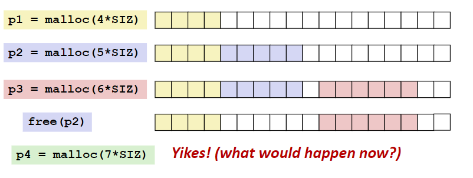
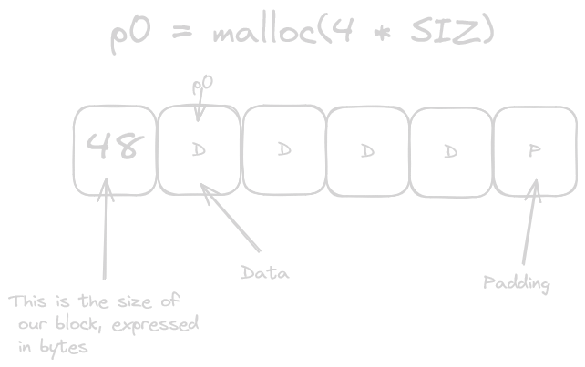

# Carnegie WaterMelon Notes - DMA Concepts

***What is DMA?***
- DMA, which is ***Dynamic Memory Allocation*** allows one to acquire virtual memory at runtime. 
    - This area of memory is known as the Heap. 

### malloc/free function

malloc and free be like: 

```c
void* malloc(size_t size);
void free(void* p)
```
***malloc***
- If malloc sucessfully finds memory to allocate, it will return the address to a memory block of the ***least size byte***
- If malloc failed, like I failed my family, it will return NULL.
***free***
- free returns the block pointed by B back to the pool of available memory. 

### Malloc padding

- alignment is very important, When the CPU reads from memory, you don't want to read from memory multiple times, cuz it comes at the cost of clock cycles. 

- This is where padding comes in place.
    - With padding, we place variables in spaces that the variable size divides
        - For example, we can only put ints in addresses that are multiples of 4. 

### Fragmentation
- Poor memory usage will cause this
    - Internal fragmentation
        - Internal Fragmentation occurs if payload is smaller than blocksize.
    - External fragmentation
        - You malloc and free in certain orders, eventually, you'll have trouble allocating memory


### Header

- How do you know, when you call free, how much data to free?
    - Easy, have some sort of data to hold information about the data allocated. 
        - This is what is known as a header field.
            - This does cost an extra word. 




### How do we keep track of free blocks?
- We have four options:
    - Method one: implicit list - links all blocks

    - Method two: explicit list - link free blocks

    - Method three: segregated free list, creating size classes
    - Method four: sort block by size.


## Detail on implicit free list

- Header is the info thing from the start, it usually gives you:
    - Size of the data
    - whether the space is free or not. 

what block can look like
```c
    typdef struct block{
        word_t header;
        unsigned char payload[0] //for simplicity. 
    } block_t;

    //we can use something like this to get the payload
    return (void*) (block->payload); //assume we have block_t* block
    // for the head
    return (block_t*)((unsigned char*) bp - offsetof(block_t,payload)); //bp points to payload
```

***Implicit List: Header access***


- This is a representation of our header data
    - How do we access these values?

- For getting the allocated? bit:
```c
return header & 0x1;
```
- For getting the size
```c
return header & ~0xfL; //maybe because of the 16 byte alignment
```
- initializing header
```c
block->header = size | alloc; //assuming block_t* block; :-D
```

***Traversing an Implicit list***
- To find the next block:

```c
static block_t* find_next(block_t* block){
    return (block_t*) ((unsigned char*)block + get_size(block));
}
```

Sesh's mom would probably ask, what does this look like? Why does this work?


- We can see that the struct points at address ***0x02***, or two in decimal, we cfor simplicity, let's assume each address is each address is one byte. The first allocation thing is allocating 2 bytes. To get to the next block:
    - We take 0x2, which block would be pointing at.
    - We take the size, which is 2
    - $0x02 + 2 = 0x04$, so we go to address 4, which is indeed where the next header is :-D


### Finding a free block for implicit list

- We have multiple options for finding a free block, some with tradeoffs:
    - First fit:
        - This is simply just finding the first free instance.
            - Pros: relatively fast
            - cons: memory fragmentation issues, poor utilization as memory
    - Next fit:
        - instead of starting from the beginnincg, you can start from the first free space.
            - pros: Faster than first fit.
            - cons: fragmentation is bad. 
    -best fit:
        - find the smallest free chunk that can fit your data.
            - pros: Best memory utilization, keeping fragments small
            - cons: slower than the other two algorithms, doesn't guarantee optimality.